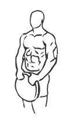
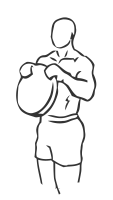

# Reverse Plate Curls with Weight

> This exercise uses a free weight plate to build muscle.

``` 
id: 0241 
type: isolation 
primary: biceps brachii 
secondary: forearm 
equipment: weight plate 
``` 


## Steps


 - Stand with your feet shoulder width apart, your knees slightly bent and your abs drawn in.
 - Grasp a plate in your hands with palms facing down, at the 11:00 and 1:00 o’clock position.
 - Keeping your elbows and arms at your side, curl the slowly up towards your head.
 - Slowly return to the starting position.

## Tips


## Images





