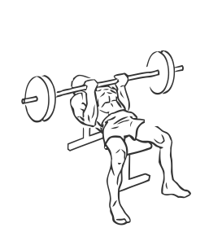
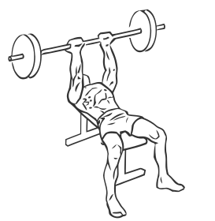

# Bench Press: Barbell (Reverse Triceps)

> This exercise is a version of the Bench Press that specifically isolates the triceps.

``` 
id: 0190 
type: compound 
primary: triceps brachii 
secondary: pectoralis major 
equipment: barbell 
``` 


## Steps


 - Lie on a flat bench with your head at one end and your feet placed firmly on the floor.
 - Grasp a barbell with palms facing your head about 16 inches apart.
 - Move the bar over your chest (about 1 inch below your nipples).
 - Extend your arms fully raising the bar fully and then lower the bar to the starting position.

## Tips


## Images





