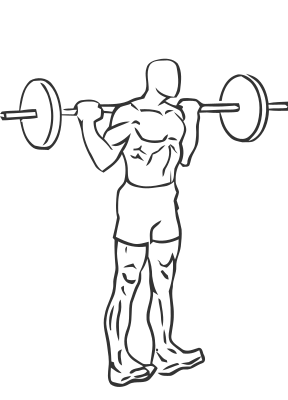
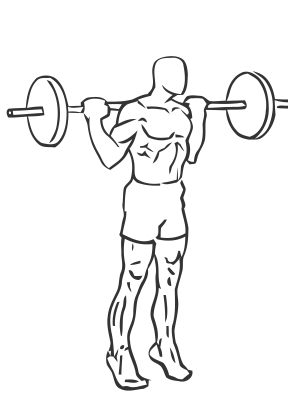

# Rocking Standing Calf Raise with Barbell

> This exercise uses a simple rocking motion to strengthen the calves.

``` 
id: 0278 
type: isolation 
primary: gastrocnemius,soleus 
secondary:  
equipment: barbell 
``` 


## Steps


 - Stand with a bar across your shoulders.
 - With your feet flat on the floor, lift your feet up and forward as if you are performing a calf raise.
 - Then “rock” back onto your ankles so your toes are flexed and off the floor.
 - Return to starting position.
 - Note: Wear running or cross training shoes while performing this exercise. Try performing this exercise without weight to become familiar with the movement,

## Tips


## Images





