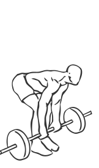
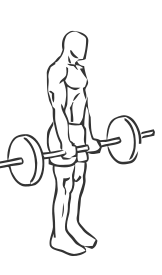

# Romanian Dead Lift

> This is an exercise similar to the regular dead lift and strengthens the hamstring, calves, quadriceps and gluts.

``` 
id: 0118 
type: isolation 
primary: ischiocrural muscles 
secondary: gastrocnemius,soleus,quadriceps,glutaeus maximus 
equipment: barbell 
``` 


## Steps


 - Place a barbell in front of your feet on the ground.
 - Grasp the barbell with a grip a bit wider than shoulder width apart.
 - Bend your knees slightly, keeping your hips and back straight.
 - Lift the bar straight up concentrating on using your hips as you stand.
 - Stand with the bar resting against your thighs.
 - Lower the bar to the floor with a slight bend in your knees flexing your hips back for stability.

## Tips


## Images





