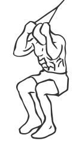
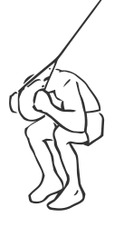

# Seated Ab Crunch with Cable

> This exercise uses the weight of a cable machine to assist in a crunch.

``` 
id: 0288 
type: isolation 
primary: abdominals 
secondary:  
equipment: cable 
``` 


## Steps


 - Attach a rope to a high cable pulley.
 - Place a bench in front of cable weight stack.
 - Grasp the rope over your shoulders and sit with your back towards the stack.
 - With your feet firmly on the floor and keeping your hips steady, flex at the waist bringing your elbows towards your knees.
 - Return to the starting position.
 - Note: Perform this exercise in a slow controlled manner.

## Tips


## Images





