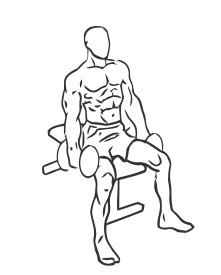
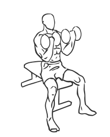

# Seated Bicep Curl with Dumbbell

> This exercise is a seated biceps curl using dumbbells.

``` 
id: 0243 
type: isolation 
primary: biceps brachii 
secondary: forearm 
equipment: dumbbell 
``` 


## Steps


 - Sit on bench with your feet firmly on the floor and your back straight.
 - Grasp a dumbbell in each hand with your palms facing each other.
 - Lower the dumbbells to your sides and slowly curl your arms up so your palms are facing up.
 - Squeeze your biceps at the top and slowly lower to the starting position.
 - Note: If possible use a short backed bench to help your posture.

## Tips


## Images





