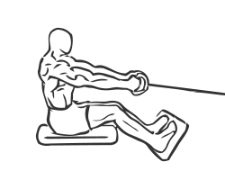
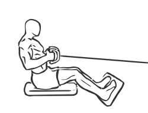

# Seated Cable Rows

> This is an exercise for middle back, biceps and lower back strengthening.

``` 
id: 0025 
type: compound 
primary: latissimus dorsi 
secondary: biceps brachii,erector spinae 
equipment: cable 
``` 


## Steps


 - Sit at a low pulley machine with your feet resting against the footrests and your knees slightly bent.
 - With your abs drawn in and your back straight lean forward slightly to grasp the pulleys with an overhand grip (palms face downwards).
 - Slowly bring the pulleys back towards your abs while sitting upright, keep your elbows in close to your chest.
 - Pause for a moment then return slowly return the pulleys to the starting position.
 - Repeat.

## Tips


 - Ensure that your back is straight at all times and do not lock your knees when rowing back.

## Images





