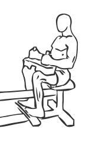
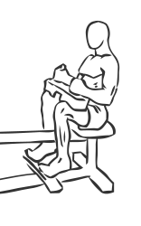

# Seated Calf Raise using Machine

> This is one of the simplest and most effective exercises for the calves.

``` 
id: 0279 
type: isolation 
primary: gastrocnemius,soleus 
secondary:  
equipment: machine 
``` 


## Steps


 - Sit at a calf raise machine.
 - Put the balls of your feet on the footpad.
 - Place your thighs under the leg pad above your knees.
 - Unlock the bar and slowly raise your toes up as far as possible.
 - Pause for a moment and then return to the starting position.
 - Note: Practice slow and precise movements with this exercise.

## Tips


## Images





