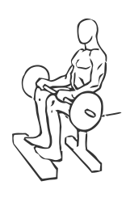
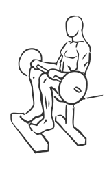

# Seated Calf Raise with Barbell

> This version of a calves raise uses a block and a barbell.

``` 
id: 0272 
type: isolation 
primary: gastrocnemius,soleus 
secondary:  
equipment: barbell 
``` 


## Steps


 - Place a block on the floor about one foot in front of a bench.
 - Sit on the bench with a barbell across your upper thighs and the balls of your feet on the block.
 - Slowly raise and lower your toes up as high as possible without lifting your foot off the block.

## Tips


## Images





