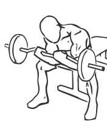

# Seated Close Grip Concentration Curls with Barbell

> Concentration exercises limit your range of movement to increase the effectiveness of the movement.

``` 
id: 0242 
type: isolation 
primary: biceps brachii 
secondary:  
equipment: barbell 
``` 


## Steps


 - Concentration exercises limit your range of movement to increase the effectiveness of the movement. This version uses a barbell.
 - Sit on the end of a flat bench with your feet flat and your legs spread apart.
 - Bend forward at your waist keeping your back straight.
 - Grasp a barbell in your hands with a close grip approximately 6 inches apart with your palms facing up.
 - With your elbow pressed against your inner thigh, curl the bar up towards your chest.
 - Slowly lower the bar to the starting position near the floor.
 - Note: Keep all of your body still except the arm you are exercising.

## Tips


## Images




