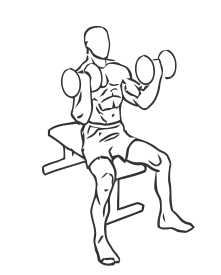

# Seated Inner Biceps Curl with Dumbbell

> This exercise works the inner biceps.

``` 
id: 0244 
type: isolation 
primary: biceps brachii 
secondary: forearm 
equipment: dumbbell 
``` 


## Steps


 - Sit on the edge of a bench with your feet firmly planted on the floor.
 - Keep your back straight and your abs drawn in.
 - Grasp a dumbbell in each arm with your palms facing each other and fully extend your arms along your sides.
 - Curl your arms up and out, turning your palms up and out as you lift.
 - Slowly lower the dumbbells to the starting position.

## Tips


## Images



