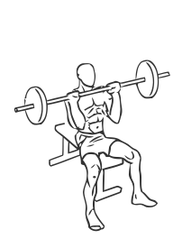
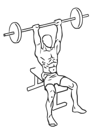

# Seated Military Press

> An exercise for the shoulder and triceps strengthening.

``` 
id: 0004 
type: isolation 
primary: deltoid 
secondary: triceps brachii 
equipment: barbell, bench 
``` 


## Steps


 - Sit on the bench with your toes pointing straight out, back straight and abs drawn in.
 - Grip the bar with your palms facing outwards and your hands shoulder width apart
 - With bar in front of your head, press upwards extending your arms but not locking them.
 - Pause at the top and then in a controlled movement lower the bar to the starting position.

## Tips


 - Ensure your hips, knees and ankles are at 90 degree positions to ensure optimal posture.
 - This exercise can also be performed with the bar in the starting position behind your head.

## Images





