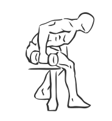
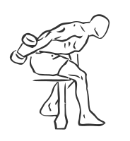

# Triceps Extension: Dumbbell (Seated, One Arm)

> This exercise uses a kickback movement to work the triceps in each arm individually.

``` 
id: 0191 
type: isolation 
primary: triceps brachii 
secondary:  
equipment: dumbbell 
``` 


## Steps


 - Sit on the edge of a bench with your feet flat on the floor.
 - Hold a dumbbell in your right hand.
 - Bring your right arm up to your side so the dumbbell is almost parallel to your chest, keeping your lower arm vertical.
 - Press your arm back in arc.
 - Return to the starting position repeat and switch arms.

## Tips


## Images





