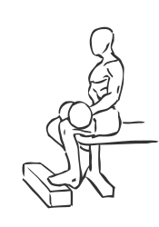
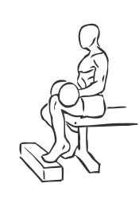

# Seated One Leg Calf Raise with Dumbbell

> This version of a calf raise allows you to exercise each leg individually.

``` 
id: 0276 
type: isolation 
primary: gastrocnemius,soleus 
secondary:  
equipment: dumbbell 
``` 


## Steps


 - This version of a calf raise allows you to exercise each leg individually. This exercise is helpful to people who are rehabilitating from injury as it allows you flexibility with the weight.
 - Place a block on the floor about one foot in front of a bench.
 - Sit on the bench with a dumbbell across your upper thigh and the balls of one foot on the block.
 - Slowly raise and lower your toe up as high as possible without lifting your foot off the block.
 - Switch feet and repeat.

## Tips


## Images





