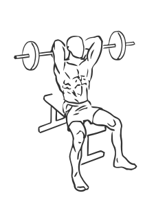
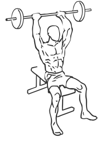

# Triceps Extension: Barbell (Seated, Overhead)

> This exercise uses a barbell behind your neck to isolate the triceps effectively.

``` 
id: 0193 
type: isolation 
primary: triceps brachii 
secondary:  
equipment: barbell 
``` 


## Steps


 - Sit on a short straight back chair with your feet firmly placed on the floor and your back straight.
 - Grasp an EZ or Curl bar, or barbell with a grip about 6 inches apart.
 - Raise the bar to arms length above your head and then lower the bar in an arc towards the floor behind your head.
 - Return to starting position.

## Tips


## Images





