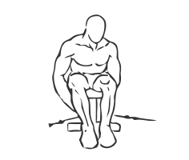
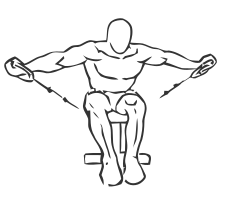

# Seated Rear Lateral Cable Raise

> Tis is an exercise for shoulder strengthening.

``` 
id: 0035 
type: isolation 
primary: deltoid 
secondary:  
equipment: cable 
``` 


## Steps


 - Sit on the edge of a bench with your feet on the floor in front of you.
 - Rest your chest on your thighs with your back straight, grasp the cable pulleys with opposite hands.
 - Raise your upper arms to shoulder height. Pause at the top for a moment.
 - Lower your arms to the starting position in a controlled motion.
 - Repeat.

## Tips


## Images





