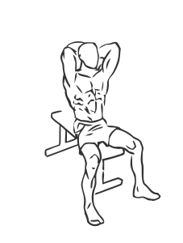
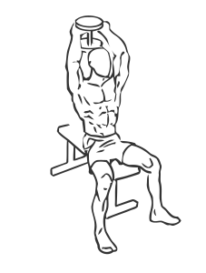

# Seated Triceps Press with Dumbbell

> This exercise uses a single dumbbell held between both hands to work the triceps.

``` 
id: 0194 
type: isolation 
primary: triceps brachii 
secondary:  
equipment: dumbbell 
``` 


## Steps


 - Sit on a short, straight backed bench with your feet planted firmly on the floor.
 - Drawing your abs in, grasp the dumbbell with both hands with a palms up grip.
 - Raise the weight over your head, this is your starting position.
 - Lower the dumbbell in an arc from above your head to behind your back.
 - Slowly return to the starting position.

## Tips


## Images





