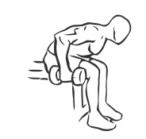
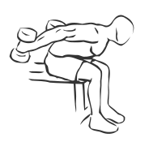

# Triceps Extension: Dumbbell (Seated, Two Arm)

> This exercise is the two handed version of seated triceps extension.

``` 
id: 0192 
type: isolation 
primary: triceps brachii 
secondary:  
equipment: dumbbell 
``` 


## Steps


 - Sit on the edge of a bench with your feet flat on the floor.
 - Hold a dumbbell in each hand.
 - Bring your arms up to your side so the dumbbell is almost parallel to your chest, keeping your lower arm vertical.
 - Press your arm back in arc towards your back.
 - Return to the starting position repeat and switch arms.

## Tips


## Images





