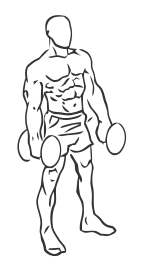
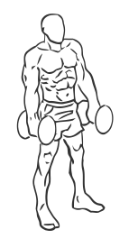

# Shoulder Shrugs: Dumbbell

> An exercise for trapezius strengthening.

``` 
id: 0005 
type: isolation 
primary: trapezius 
secondary:  
equipment: dumbbell 
``` 


## Steps


 - Stand with your feet shoulder width apart and a slight bend in your knees.
 - Hold a dumbbell in each hand and with your arms at your sides.
 - Lower your shoulders as much as possible.
 - With your arms straight raise both shoulders up towards your ears.
 - Hold the upright positions for a moment and then lower in a controlled motion.

## Tips


 - Do not do this exercise if you are experiencing any shoulder or neck pain.

## Images





