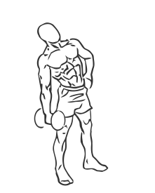
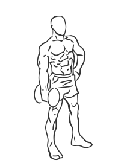

# Side Bend with Dumbbell

> This exercise works the obliques, the muscles on the sides of your abs.

``` 
id: 0294 
type: isolation 
primary: abdominals 
secondary:  
equipment: dumbbell 
``` 


## Steps


 - Stand with your feet shoulder width apart, your knees slightly bent and your abs drawn in.
 - Grasp a dumbbell in one hand and standing straight upright, bend at the waist as far as possible to one side.
 - Slowly return back up to the staring position.
 - Switch the dumbbell to your other hand and repeat the exercise.
 - Note: Be careful to bend only at your waist and not at the hips or knees.

## Tips


## Images





