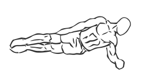
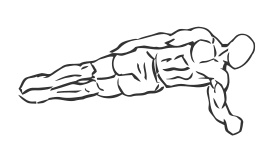

# Side Plank

> This is an exercise for core strengthening.

``` 
id: 0113 
type: isolation 
primary: obliques 
secondary:  
equipment: body 
``` 


## Steps


 - Lay on one side of your body with your legs straight and your forearm perpendicular to your body in front of you.
 - Drawing your abs in, slowly raise yourself up so you are balanced on your feet and your forearm.
 - Hold this position and slowly return back to the starting position.
 - Repeat on other side.

## Tips


## Images





