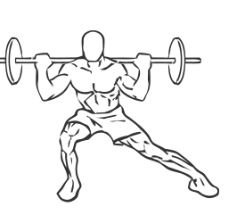
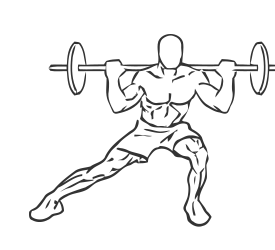

# Side Squats: Barbell

> This version of a squat works the hip adductors, helping build better core strength and coordination.

``` 
id: 0131 
type: compound 
primary: quadriceps 
secondary: hip abductors,ischiocrural muscles 
equipment: barbell 
``` 


## Steps


 - Place a barbell on your shoulders and grasp it with a wide grip.
 - Stand with your feet wide apart, with the foot of the leg you will be leaning towards angled out.
 - Bring your lower body to your foot by bending the hip and knee of your lead leg, and keeping your other leg fairly straight.
 - Return to the starting position and switch legs.

## Tips


## Images





