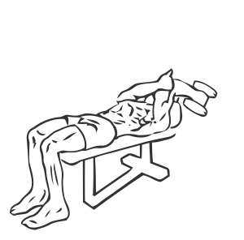
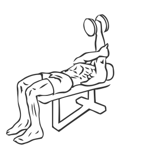

# Triceps Extension: Dumbbell (Single Arm, Supinated)

> This exercise is similar to the Single Arm Pronated Triceps Extension except the movement is over the head instead of across the chest.

``` 
id: 0187 
type: isolation 
primary: triceps brachii 
secondary:  
equipment: dumbbell 
``` 


## Steps


 - Lie flat in a bench with your head at one end and your feet placed firmly on the floor.
 - Grasp a dumbbell in one hand and raise it to a position above your chest, with your palm facing the floor.
 - Place your free hand under the shoulder to support your other arm. Slowly bend your elbow over your head with the weight moving only your forearm and elbow.
 - Return to the starting position and repeat with your other arm.
 - Note: Practice this exercise with light weight to get used to the movements.

## Tips


## Images





