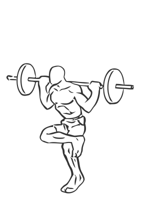
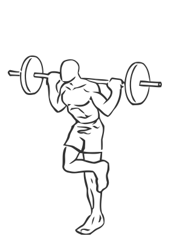

# Single Leg Squat with Barbell

> This is an advanced exercise and modification of the basic squat.

``` 
id: 0132 
type: compound 
primary: quadriceps 
secondary: gastrocnemius,soleus,ischiocrural muscles 
equipment: barbell 
``` 


## Steps


 - This is an advanced exercise and modification of the basic squat. Mastery of the squat is recommended before attempting this exercise.
 - Place a barbell on your back, above your shoulders with a wide grip.
 - Cross the lower leg above the knee of your supporting leg (the leg you will squat with).
 - Squat down as low as you are able.
 - Slowly return to an upright position by straightening your hip and knee.
 - Switch legs and repeat.

## Tips


## Images





