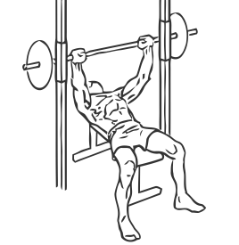

# Bench Press: Smith Machine

> With the use of a Smith Machine this exercise strengthens your chest shoulders and triceps.

``` 
id: 0078 
type: isolation 
primary: pectoralis major 
secondary: deltoid,triceps brachii 
equipment: flat bench, smith machine 
``` 


## Steps


 - Place a flat bench in the middle of the Smith Machine, with the bar in line with the middle of your chest.
 - Lying on the bench, grasp the bar at shoulder width apart.
 - Unlatch the bar and slowly lower the bar to your chest.
 - Extend your arms fully and raise the bar to the starting position.
 - Repeat.

## Tips


 - Ensure your hips and back remain in contact with the bench throughout this exercise.

## Images




