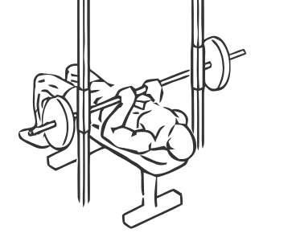
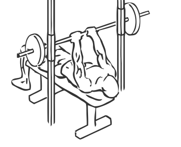

# Bench Press: Smith Machine (Close Grip)

> This version of a Bench Press uses a close grip to isolate the triceps as well as working the chest.

``` 
id: 0195 
type: compound 
primary: triceps brachii 
secondary: pectoralis major 
equipment: smith machine 
``` 


## Steps


 - Place a flat bench in the middle of a Smith Machine.
 - Using a close grip (about 6 inches apart) unlatch the bar and lower it towards your chest.
 - Pause just before the bar hits your chest and raise the bar by extending your arms to the starting position.

## Tips


## Images





