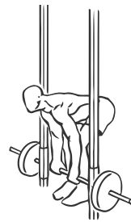
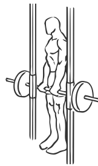

# Dead Lifts: Smith Machine

> This is the same as a Dead Lift but the Smith Machine allows for better control of the weight.

``` 
id: 0100 
type: isolation 
primary: erector spinae 
secondary: ischiocrural muscles,gastrocnemius,soleus 
equipment: smith machine 
``` 


## Steps


 - Stand with your feet shoulder width apart so that your feet are under the bar.
 - Keeping your back straight bend at the waist, allow some bend in your knees.
 - Grasp the par with an overhand grip approximately 16 inches apart.
 - Straighten your back as you hold the bar at arm’s length.
 - Bend over again lowering the bar to just above the floor.

## Tips


## Images





