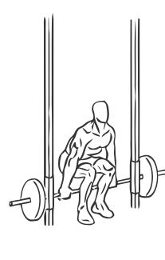
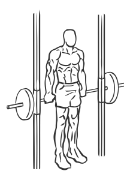

# Smith Machine Hack Squat

> This is another variation of the basic Squat that focuses primarily on the quadriceps, or thigh muscles, while using the Smith Machine.

``` 
id: 0126 
type: compound 
primary: quadriceps 
secondary: ischiocrural muscles,glutaeus maximus 
equipment: smith machine 
``` 


## Steps


 - This is another variation of the basic Squat that focuses primarily on the quadriceps, or thigh muscles, while using the Smith Machine.
 - Adjust the bar to a low setting just above your ankles.
 - Stand with the bar on the floor just behind your legs, with your feet shoulder width apart and your toes pointing forward.
 - With your feet firmly placed on the floor reach down and grasp the bar from behind, with an overhand grip.
 - Lift the bar by extending your hips and knees, taking care not to lock your knees.
 - Lower yourself (squat) down until your thighs are parallel to the floor.
 - Slowly raise yourself up to starting position.
 - Note: Your knees should be moving in the same direction as your feet.

## Tips


## Images





