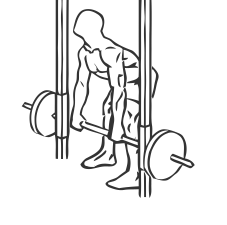
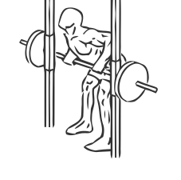

# Smith Machine Rear Deltoid Row

> A exercise for the rear deltoid

``` 
id: 0022 
type: isolation 
primary: deltoid 
secondary: back,biceps brachii 
equipment: smith machine 
``` 


## Steps


 - This is an exercise for rear deltoid,shoulder, biceps and back strengthening.
 -  Set the bar to the lowest setting.
 - Place your feet shoulder width apart with a slight bend in the knees.
 - Bend at the waist while keeping your back straight and chest parallel to the floor.
 - Grasp the bar slightly wider than your shoulders with an overhand grasp and your arms straight with a slight bend in the elbows.
 - Raise the bar with a controlled motion to the lower part of your chest by bending and elevating your elbows.
 - Hold for a moment and then lower to the starting position.
 - Repeat.

## Tips


 - Ensure you back is straight and that you maintain a good posture throughout this exercise.

## Images





