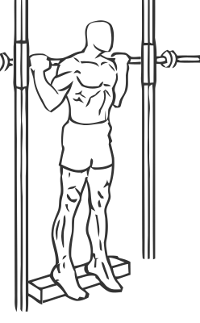
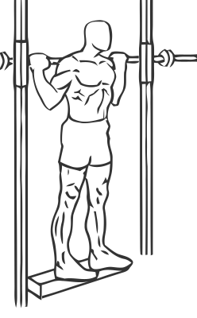

# Smith Machine Reverse Calf Raises

> This is a unique exercise that works the tibialis anterior muscle, one of the muscles of the calves.

``` 
id: 0280 
type: isolation 
primary: gastrocnemius,soleus 
secondary:  
equipment: smith machine 
``` 


## Steps


 - Place a block or low box under the bar at a Smith Machine.
 - Stand on the edge of the box with your toes hanging off.
 - Place the bar across your shoulders and lean forward lifting your ankles off the box.
 - Return to the starting position.
 - Note: Use the bar for support as you perform this exercise.

## Tips


## Images





