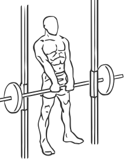
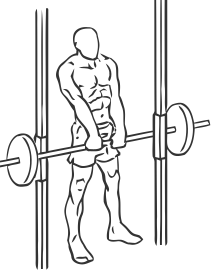

# Shoulder Shrugs: Smith Machine

> This is an exercise for shoulder strengthening.

``` 
id: 0041 
type: isolation 
primary: deltoid 
secondary:  
equipment: smith machine 
``` 


## Steps


 - Place the barbell at waist height.
 - Stand with your feet shoulder width apart and your abs drawn in.
 - Grasp the bar with an overhand grip and straightened arms.
 - As you lift the bar allow the weight to pull your shoulders down, shrug your shoulders up and to the back.
 - Hold for a moment and then return to starting position.

## Tips


## Images





