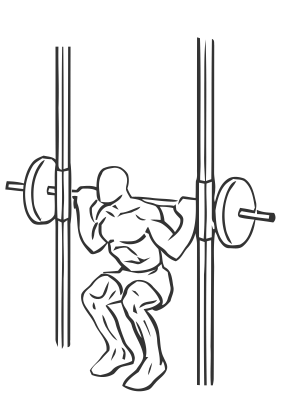
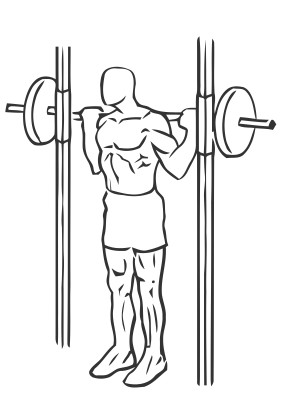

# Squats: Smith Machine

> This exercise is a variation of a squat using the Smith Machine.

``` 
id: 0124 
type: compound 
primary: quadriceps 
secondary: gastrocnemius,soleus,glutaeus maximus,ischiocrural muscles 
equipment: smith machine 
``` 


## Steps


 - This exercise uses the Smith Machine to work the Quadriceps, Hamstrings, Calves and Glutes. A great overall exercise for the lower body. There are many variations on the squat, this is the original version using a Smith Machine for better flow of movement.
 - Set the height of the barbell to shoulder height.
 - Place your feet slightly wider than shoulder width apart with your knees and toes pointed slightly outward.
 - Drawing your abs in descend slowly by bending at the knees and hips as if you are sitting down (squatting).
 - Lower yourself as far as you can control without letting your body shift over your toes (this will cause you to loose balance).
 - Pause in the downward squatting position and slowly return upright to the starting position.
 - If needed, a pad on the bar or towel on your shoulders can help improve your grip and the reduce the discomfort of the bar against your back. First practice the squat without any weight to allow yourself to become comfortable with the movements.

## Tips


## Images





