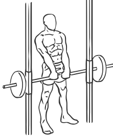

# Upright Row: Smith Machine

> This is an exercise for shoulder and biceps strengthening.

``` 
id: 0013 
type: isolation 
primary: deltoid 
secondary: biceps brachii,upper back 
equipment: smith machine 
``` 


## Steps


 - Stand with your feet shoulder width apart and your abs drawn in.
 - Place the bar on the Smith Machine in the position where your arms are fully extended in front of you.
 - Place your hands shoulder width apart and raise the bar up towards your chin with a controlled motion.
 - Pause at the top for a moment and rotate your shoulder blades together.
 - Lower the bar to the starting position.

## Tips


 - Ensure you do not arch your back when pulling the bar up towards your chin.

## Images




