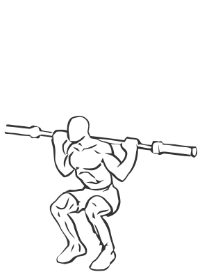
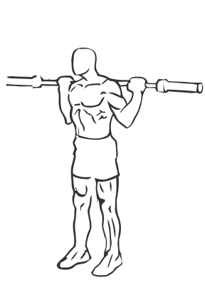

# Speed Squats: Barbell

> This version of the squat uses an empty barbell and moves at a faster pace than the standard squat.

``` 
id: 0154 
type: compound 
primary: quadriceps 
secondary: gastrocnemius,soleus,glutaeus maximus,ischiocrural muscles 
equipment: barbell 
``` 


## Steps


 - This version of the squat uses an empty barbell and moves at a faster pace than the standard squat. This is a good exercise for building speed and conditioning used in running and jumping sports.
 - Place your feet slightly wider than shoulder width apart with your knees and toes pointed slightly outward.
 - Drawing your abs in, descend slowly by bending at the knees and hips as if you are sitting down (squatting).
 - Lower yourself as far as you can control without letting your body shift towards your toes (this will cause you to loose balance).
 - Pause in the downward position and slowly return upright to the starting position.
 - Note: Keep your feet firmly planted on the floor throughout this exercise.

## Tips


## Images





