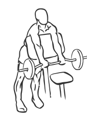
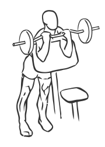

# Spider Curl with Barbell

> 

``` 
id: 0245 
type: isolation 
primary: biceps brachii 
secondary:  
equipment: barbell 
``` 


## Steps


 - This exercise uses the straight side of a Preacher Curl bench to increase the range of motion of the exercise.
 - Turn a Preacher Curl bench around so you are leaning against the angled side.
 - Grasp a barbell with palms up, approximately 6 inches apart.
 - Leaning against the bench, lower the bar along the flat side of the bench fully extending your arms.
 - Curl your arms up so your biceps are touching your forearms.
 - Slowly lower the bar to the starting position.
 - Note: Use a low weight to get used to the motion of this exercise.

## Tips


## Images





