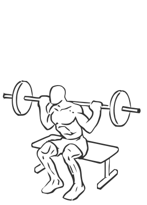
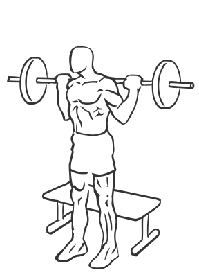

# Squats: Barbell (to Bench)

> This variation on a squat uses a bench to remind you how far down to squat.

``` 
id: 0133 
type: compound 
primary: quadriceps 
secondary: glutaeus maximus,gastrocnemius,soleus,ischiocrural muscles 
equipment: barbell, bench 
``` 


## Steps


 - This is s great overall exercise for the lower body. There are many variations on the squat, this one uses a bench to remind you how far down to squat.
 - Place a bench behind you.
 - Lifting a barbell off of a weight rack, position it on your shoulders.
 - Place your feet slightly wider than shoulder width apart with your knees and toes pointed slightly outward.
 - Drawing your abs in, descend slowly and squat down, bending at the knees and hips.
 - Lower yourself as far as you can control without letting your body shift towards your toes (this will cause you to loose balance). Do not sit on the bench.
 - Pause in the downward position and slowly return upright to the starting position.
 - A pad on the bar or towel on your shoulders can help improve your grip and reduce discomfort of the bar against your back. Practice the squat without any weight to allow yourself to become comfortable with the movements. Do not sit on the bench during the exercise.

## Tips


## Images





