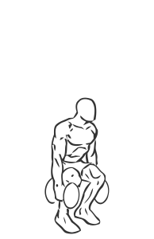
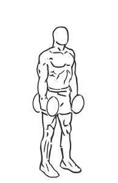

# Squats: Dumbbells

> This is a great overall exercise for the lower body that uses dumbbells.

``` 
id: 0130 
type: compound 
primary: quadriceps 
secondary: ischiocrural muscles,gastrocnemius,soleus 
equipment: dumbbells 
``` 


## Steps


 - This is a great overall exercise for the lower body that uses dumbbells instead of a barbell. Beginners may find this version easier to perform.
 - Grasp a dumbbell in each hand.
 - Stand with feet slightly wider than shoulder width apart with your knees and toes pointed slightly outward.
 - Drawing your abs in descend slowly by bending at the knees and hips as if you are sitting down (squatting).
 - Lower yourself as far as you can control without letting your body shift towards your toes (this will cause you to loose balance).
 - Pause in the downward position and slowly return upright to the starting position.
 - Note: Practicing the squat without any weight will allow you to become comfortable with the movements.

## Tips


## Images





