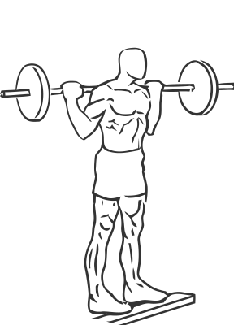
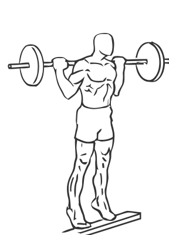

# Standing Barbell Calf Raise

> This is standing version of a Calf Raise.

``` 
id: 0281 
type: isolation 
primary: gastrocnemius,soleus 
secondary:  
equipment: barbell 
``` 


## Steps


 - Place a block or two free weight plates on the floor.
 - Place a barbell across your back and step up so the balls of your feet are on the block.
 - Slowly lift your heels up and then lower them back to the floor getting as much of a stretch as possible.
 - Return to starting position.

## Tips


## Images





