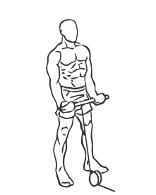
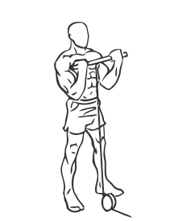

# Standing Biceps Curl with Cable

> This version of the biceps curl uses a cable instead of a barbell to work the muscles of the arms.

``` 
id: 0212 
type: isolation 
primary: biceps brachii 
secondary: forearm,deltoid 
equipment: cable 
``` 


## Steps


 - Attach a short bar to a cable pulley to the bottom of the weight stack.
 - Stand with your feet shoulder width apart, your knees slightly bent and your abs drawn in.
 - Grasp the bar with palms facing up, and hands fairly close together.
 - Lower your arms fully to above your thighs and bending only your elbows, raise the bar to your upper chest.
 - Pause for a moment and then return to the starting position.
 - Note: Do not swing your hips or back during this exercise.

## Tips


## Images





