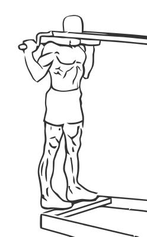
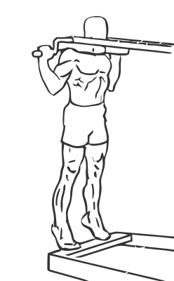

# Standing Calf Raises using Machine

> This exercise uses a machine to allow for proper form.

``` 
id: 0282 
type: isolation 
primary: gastrocnemius,soleus 
secondary:  
equipment: machine 
``` 


## Steps


 - This exercise uses a machine to allow for proper form.
 - Stand with your toes on the footpad of the machine and adjust your shoulders under the upper pads.
 - Raise up on the balls of your feet, lifting your heels off the pad.
 - Hold for a moment and then return to the starting position.

## Tips


## Images





