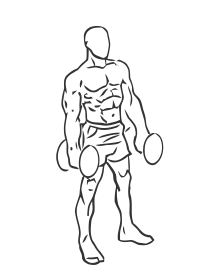
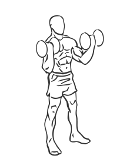

# Standing Inner Biceps Curl with Dumbbell

> This exercise works the inner biceps.

``` 
id: 0246 
type: isolation 
primary: biceps brachii 
secondary: forearm 
equipment: dumbbell 
``` 


## Steps


 - Stand with your feet shoulder width apart, your knees slightly bent and your abs drawn in.
 - Grasp a dumbbell in each arm with your palms facing each other, fully extend your arms along your sides.
 - Curl your arms up and out, turning your palms up and out as you lift.
 - Slowly lower the dumbbells to the starting position.
 - Note: Try to keep your forearms in line with your shoulders as you lift the weight.

## Tips


## Images





