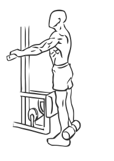

# Standing Leg Curls

> This is an exercise for hamstring strengthening.

``` 
id: 0120 
type: isolation 
primary: ischiocrural muscles 
secondary:  
equipment: machine 
``` 


## Steps


 - Standing at a leg curl machine adjust the rear footpad so it is just above your ankle.
 - Grasp the handles of the machine for support and draw your abs in.
 - Raise your foot up towards your back slowly.
 - Return to the starting position and chance legs.

## Tips


## Images




