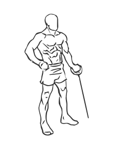
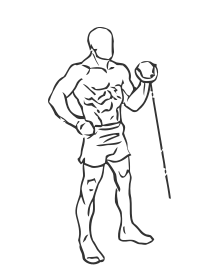

# Standing One Arm Bicep Curl with Cable

> This is a single arm version of a bicep cable curl.

``` 
id: 0247 
type: isolation 
primary: biceps brachii 
secondary: forearm 
equipment: cable 
``` 


## Steps


 - This is a single arm version of a bicep cable curl. Cable machines are great for helping you learn proper form while building muscle.
 - Attach a stirrup bar to a low cable pulley.
 - Stand of the side of the weight stack with your legs shoulder width apart and your knees slightly bent and your abs drawn in.
 - Grasp the stirrup in one hand with an palms facing up.
 - Lower the stirrup to the top of your thighs.
 - Keeping your elbows still, curl the stirrup up towards your chest.
 - Slowly lower the stirrup to the starting position.

## Tips


## Images





