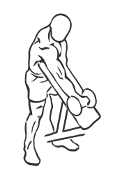
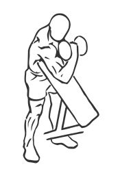

# Standing One Arm Curl Over Incline Bench with Dumbbell

> 

``` 
id: 0248 
type: isolation 
primary: biceps brachii 
secondary: forearm 
equipment: dumbbell 
``` 


## Steps


 - This exercise is a great alternative to the Preacher Curl.
 - Stand in front of an incline bench so your arm is resting on the top of the angled portion of the bench.
 - Grasp a dumbbell in your hand with palms facing up.
 - Rest your arm against the back bench and extend it fully down.
 - Keeping your arm on the bench at all times, curl the dumbbell up towards your head.
 - Pause for a moment and then lower the dumbbell back to starting position.
 - Switch arms and repeat.
 - Note: Perform this exercise in a slow controlled manner for best results.

## Tips


## Images





