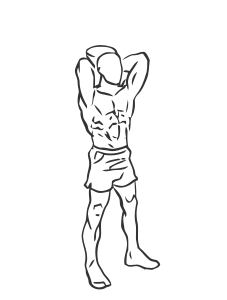
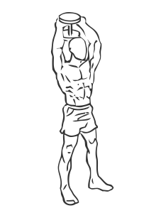

# Triceps Extension: Dumbbell (Standing)

> This exercise works the triceps by reaching behind your neck.

``` 
id: 0198 
type: isolation 
primary: triceps brachii 
secondary:  
equipment: dumbbell 
``` 


## Steps


 - Stand with your feet shoulder width apart, your back straight and your abs drawn in.
 - Hold a dumbbell in both hands, with your palms facing up.
 - Raise the dumbbell over your head and slowly lower the dumbbell in an arc behind your head.
 - Slowly raise the dumbbell back up to the starting position.

## Tips


 - Keep your elbows close to your head during the exercise.

## Images





