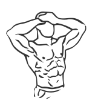
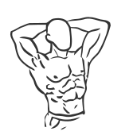

# Static Neck Flexion and Extension

> An exercise to either build or warm-up front and back neck strength.

``` 
id: 0001 
type: isometric 
primary: trapezius 
secondary:  
equipment: body 
``` 


## Steps


 - An exercise to either build or warm-up front and back neck muscles.
 - Stand or sit with your head in neutral position.
 - Place both of your hands on your forehead.
 - Press your head against your hands and contract your neck muscles.
 - Keep your head from moving forward. Hold for at least 30 seconds.
 - Repeat with hands on the back of your head, pressing against them.

## Tips


## Images





