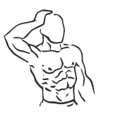
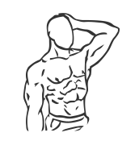

# Static Neck Side Flexion

> An exercise either build or warm up neck side flexors.

``` 
id: 0002 
type: isometric 
primary: trapezius 
secondary:  
equipment: body 
``` 


## Steps


 - Stand or sit with your head in neutral position.
 - Place your left hand against the left side of your head, above your ear.
 - Push your head against your hand, without moving your head.
 - Repeat with your right hand, right side of your head.

## Tips


 - Make sure you maintain your chin at a 90 degree angle to your neck

## Images





