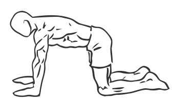
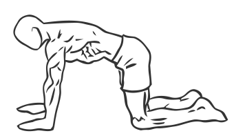

# Stationary Abdominal Draw In

> This is an exercise for abdominal and core strengthening which are vital in supporting the spine.

``` 
id: 0027 
type: isometric 
primary: abdominals 
secondary: core 
equipment: body 
``` 


## Steps


 - Get down on a mat on your hands and knees, forming a four point rectangle or square shape.
 - Keep your back straight and your hips and pelvis in a neutral position.
 - Draw your abs in, crunching your abs while keeping your back still.
 - Hold for a moment and then release returning to the starting position.
 - Repeat.

## Tips


 - For this exercise to be maximally effective your back should not move at all through out the contraction and relaxation.

## Images





