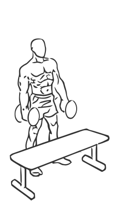
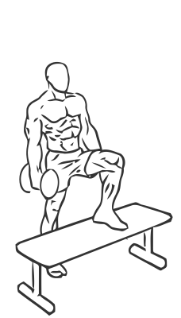

# Step Up: Dumbbell (Bicep Curl, Single Leg Balance)

> This exercise combines a step up with a bicep curl.

``` 
id: 0266 
type: isolation 
primary: biceps brachii 
secondary: core,quadriceps,forearm,ischiocrural muscles,glutaeus maximus,gastrocnemius,soleus 
equipment: dumbbell 
``` 


## Steps


 - This is an advanced exercise. This exercise combines a step up with a bicep curl.
 - Place a box or bench in front of you.
 - Place a dumbbell in each hand with palms facing up.
 - Keep your back straight, your shoulders back and your abs drawn in.
 - With one leg, step up on to the box and raise your other leg up (as if taking another step).
 - At the top of the step, curl your arms up by bringing your biceps towards your shoulders.
 - Return to the starting position and switch legs.

## Tips


## Images





