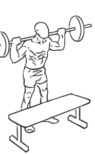
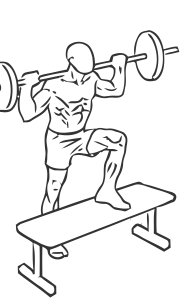

# Step Ups: Barbell

> This exercise builds coordination as well as muscle.

``` 
id: 0134 
type: compound 
primary: quadriceps 
secondary: ischiocrural muscles,gastrocnemius,soleus 
equipment: barbell 
``` 


## Steps


 - Place a bench, box or step in front of you.
 - Grasp a barbell with a wide grip and place it across your shoulders.
 - With your left leg, step up on the bench, and follow by stepping up with your right leg.
 - Step down with your left leg and then your right leg.
 - Repeat starting with your right leg.
 - Note: Use a lighter weight until you are used to the motion of this exercise.

## Tips


## Images





